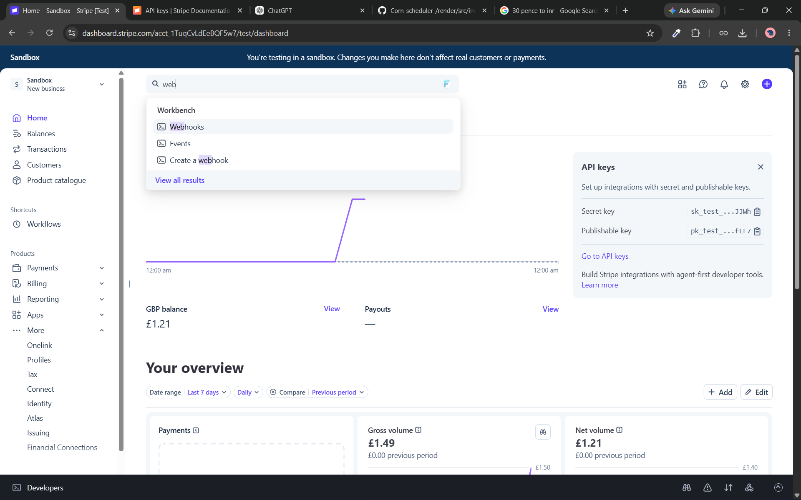
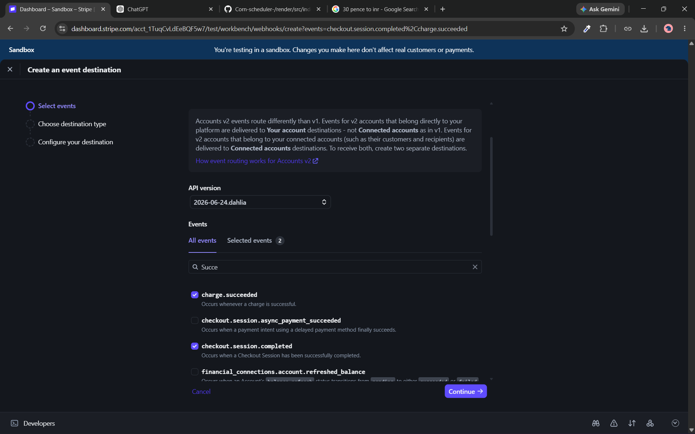
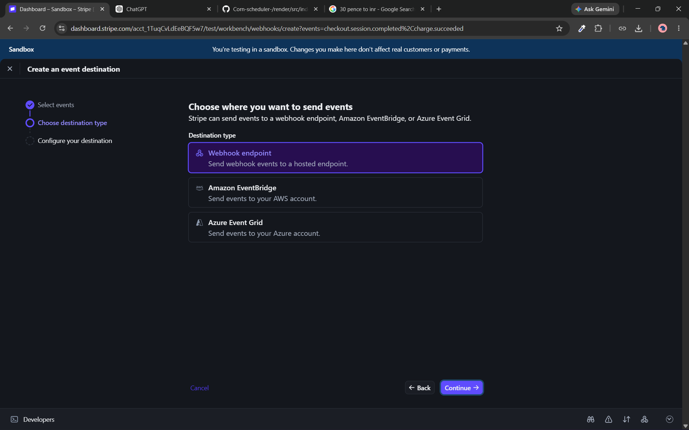
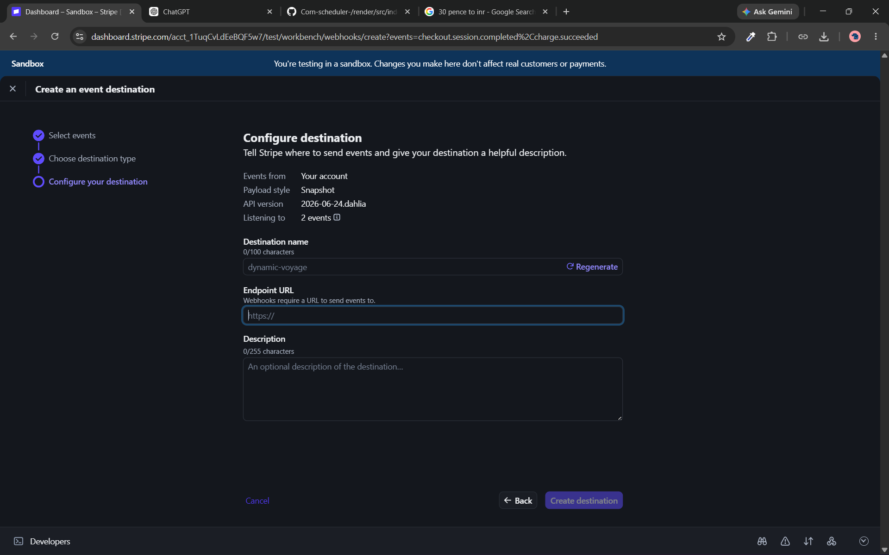

1. [Introduction](#introduction)
2. [How payment gateway works](#how-a-payment-gateway-works)
3. [How to set up strip (Payment gateway)](#how-to-set-up-strip-payment-gateway)

---

# Introduction

A **payment gateway** is a technology that securely processes online payments between a customer, a merchant, and a bank. It acts like a **digital payment terminal** for websites, mobile apps, and online stores.

### How a payment gateway works

1. A customer selects products and clicks **Pay**.
2. They enter payment details (credit/debit card, UPI, net banking, or digital wallet).
3. The payment gateway encrypts the information to keep it secure.
4. It sends the payment request to the customer's bank for authorization.
5. The bank approves or declines the transaction.
6. The gateway sends the result back to the merchant, and the customer sees a success or failure message.

### Simple example

Imagine you're shopping online:

* You buy a pair of shoes for **₹2,000**.
* You pay using your debit card.
* The payment gateway securely transfers your payment information to the bank.
* If the bank approves the payment, the merchant receives confirmation, and your order is placed.

### Common payment gateways

* PayPal
* Stripe
* Razorpay
* PayU
* Cashfree Payments

> In this tutorial we'll be using strip
 
### Benefits

* Secure payment processing
* Supports multiple payment methods
* Reduces fraud through encryption and verification
* Enables businesses to accept payments from customers worldwide

In short, a **payment gateway** is the secure service that **authorizes and processes online payments**, ensuring money is transferred safely from the customer to the merchant.

---

# How payment gateway works
Imagine you buy a laptop worth ₹50,000.
### Step 1: Checkout
You click Checkout button and website creates an order object and send it to backend.
```json
{
  "orderId": "ORD123",
  "amount": 50000, 
  "Quantity": 1
}
```
### Step 2: backend contacts Payment Gateway
The backend sends
```js
Amount = ₹50,000
Currency = INR
Order ID = ORD123
```
to Strip (or another gateway).

once payment gateway receive your payment request it create a session for payment to take place and return that session url
```json
{
    "url": "https://abc.com"
}
```
we send this url to frontend

### Step 3: Opens the payment page at frontend
once we receive the session url for payment we visit the url to open the payment page, where you'll see
- Credit Card
- Debit Card
- UPI
- Net Banking
- Wallets

> only available options

### Step 4: User enters payment details
Example
```
Card Number
Expiry
CVV
OTP

OR

UPI ID
```
### Step 5: Gateway sends payment request
The gateway does not decide whether you have money.

It forwards the request to
```
Payment Gateway
        ↓
Merchant Bank (receiver Bank)
        ↓
Visa / Mastercard / NPCI
        ↓
Your Bank (senders Bank)
```

### Step 6: Senders bank verifies

Your bank checks

- Is the card active?
- Is the CVV correct?
- Is the OTP correct?
- Is there enough balance or credit limit?
- Is the transaction suspicious?

If everything is okay
```
APPROVED
```
Otherwise
```
DECLINED
```

---

# How to set up strip (Payment gateway)
Stripe is a payment gateway and payment processor that lets businesses accept online payments. It provides APIs and tools so developers can easily integrate payments into websites and mobile apps.

> official docs: https://stripe.com/payments

## Backend Setup
to setup payment gateway in backend we need an api that do following task:
- accepts the payment info from client
- call the strip (payment gateway) and create the session
- return the session url so that user can visit it and do payment
- handle redirect once payment is successful or canaled
#### 1. initiate the empty express project
- create node project

    ```bash
    npm init -y
    ```
- install dependence
    ```bash
    npm install express 
    ```
- update `package.json`
    ```json
    {
        "type": "module",
        "scripts":{
            "dev": "node src/index.js"
        }
    }
    ```
- wite a boiler plate code
    ```js
    import express from "express";

    const app = express();

    app.use(express.json());    // to accept json data from frontend

    app.listen(3000, () => {
        console.log("Server is running on port 3000");
    });
    ```
#### 2. create the api that return the session url fo payment
- initialize the empty checkout api

    ```js
    app.post("/checkout", async (req, res) => {...});
    ```
- accept the data send by frontend
    ```js
    app.post("/checkout", async (req, res) => {
        const { quantity } = req.body;  // in this example we are accepting quantity but you can accept whatever data you want
    });
    ```
- create the strip session
    ```js
    app.post("/checkout", async (req, res) => {
        const { quantity } = req.body;

        const session = await stripeInstance.checkout.sessions.create({
            payment_method_types: ["card"],     // what type of payment method is available, e.g, card, UPI, bank transaction, etc
            mode: "payment", // what type of transaction is it, one time payment, subscription, etc
            success_url: "http://localhost:3000/success",   // where to redirect once payment is successful
            cancel_url: "http://localhost:3000/cancel", // where to redirect once payment is cancel
            line_items: [
                {
                    price_data: {
                        currency: "inr",    // in what currency the transaction takes place
                        product_data: {
                            name: "Premium Plan",
                        },
                        unit_amount: 10000,   // amount of single item that you want to purchase here, 1 inr = 100 Paise i.e, 10000 paise = 100inr
                    },
                    quantity: quantity,     // quantity of items you want to purchase
                },
            ],
        });
    });
    ```
> NOTE: strip take 2% commission on your transaction and thats why strip has limit on minimum transaction, so make sure your all transaction is above that limit also this limit depended on your resin and currency. In our example its up to 39 inr i.e, 3900 paise 
#### 3. return the session url
```js
app.post("/checkout", async (req, res) => {
    const { quantity } = req.body;

    const session = await stripeInstance.checkout.sessions.create({
        payment_method_types: ["card"],
        mode: "payment",
        success_url: "http://localhost:3000/success",
        cancel_url: "http://localhost:3000/cancel",
        line_items: [
            {
                price_data: {
                    currency: "inr",
                    product_data: {
                        name: "Premium Plan",
                    },
                    unit_amount: 10000,
                },
                quantity: quantity,
            },
        ],
    });

    res.json({ url: session.url }); // returning the session url 
});
```
#### 4. exception handling
```js
app.post("/checkout", async (req, res) => {
    try {
        const { quantity } = req.body;

        const session = await stripeInstance.checkout.sessions.create({
            payment_method_types: ["card"],
            mode: "payment",
            success_url: "http://localhost:3000/success",
            cancel_url: "http://localhost:3000/cancel",
            line_items: [
                {
                    price_data: {
                        currency: "inr",
                        product_data: {
                            name: "Premium Plan",
                        },
                        unit_amount: 10000,
                    },
                    quantity: quantity,
                },
            ],
        });

        res.json({ url: session.url });
    } catch (err) {
        res.status(500).json({ error: err.message });
    }
});
```
## Frontend
in frontend we just need to call this api and handle redirect if backend return the session url

#### 1. call the backend api with data
```js
const res = await fetch('/checkout', {
    method: 'POST',
    headers: {
        'Content-Type': 'application/json'
    },
    body: JSON.stringify({ quantity: 2 })   // in this example we are using quantity, you can have whatever data you want
});
```

#### 2. check whether or not session creates successfully?
```js
const res = await fetch('/checkout', {
    method: 'POST',
    headers: {
        'Content-Type': 'application/json'
    },
    body: JSON.stringify({ quantity: 2 })
});
if(res.ok){
    // session created successfully
}
```
#### 3. if session created successfully then navigate to session url i.e, payment page
```js
const res = await fetch('/checkout', {
    method: 'POST',
    headers: {
        'Content-Type': 'application/json'
    },
    body: JSON.stringify({ quantity: 2 })
});
if(res.ok){
    const data = await res.json();
    window.location.href = data.url // navigating to session url i.e, payment page
}
```

#### 4. payment gateway handle the rest
- now since you navigate to payment page payment gateway will take care of your transaction 
- once the transaction is successful or cancel payment gateway will handle the redirect accordingly 

---

# How to save data into database
in above setup we see how to setup strip payment gateway and perform transaction, but we didn't know how to save those transaction details into our database

to do that we use webHooks

### What ae webhooks
A webhook is a way for one application to automatically notify another application when something happens.

**Without a webhook (Polling)**
```
Your Backend
      │
      ├── Is payment done?
      ├── Is payment done?
      ├── Is payment done?
      └── Is payment done?
```
**With a webhook**
- When a customer pays:

    ```
    Customer
         │
         ▼
    Stripe Checkout
    ```
- Once the payment succeeds:
    ```
    Stripe
        │
        │ POST /webhook
        ▼
    Your Express Server
    ```
**What does Stripe send?**
- It sends an HTTP POST request.\
Example:

    ```json
    POST /webhook

    {
      "type": "checkout.session.completed",
      "data": {
        "object": {
          "id": "cs_test_123",
          "payment_status": "paid",
          "amount_total": 5000
        }
      }
    }
    ```
- Your Express app receives it like any other POST request.
    ```js
    app.post("/webhook", (req, res) => {
        // save payment info into database
        console.log(req.body);
    });
    ```

### How to setup webhook
1. **go to strip dashboard and search for webhook**

    

2. **Add the trigger for webhook**

    

3. **select the destination type which is webhook** 

    

4. **add the destination url** 

    

note: this will not work on localhost webhook api as strips localhost is different than that of yours ans strip has no access to your localhost

therefore you must deploy your webhook api and then add the deployed url

> To test localhost webhook you can use strip cli