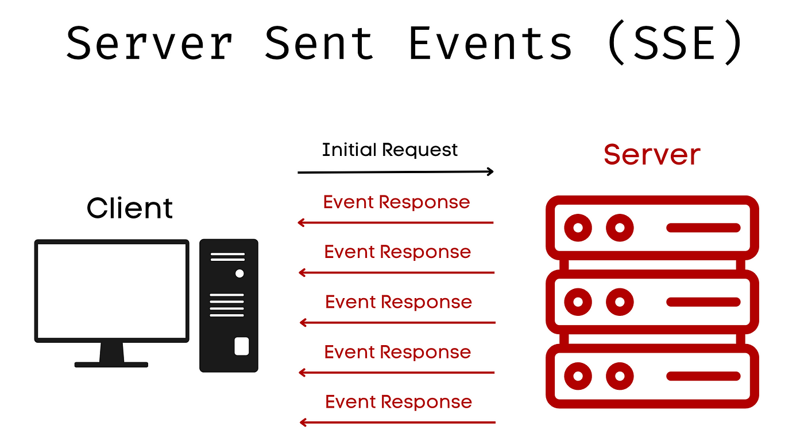

# Server-Sent Events (SSE)

Server-Sent Events (SSE) is a web technology that allows a server to send real-time updates to a client over a single, long-lived HTTP connection, where the client only listens and the server continuously pushes data whenever it becomes available.
- SSE works by the client opening a normal HTTP request using the browser’s built-in EventSource API.
- After which the server responds with special headers (`Content-Type: text/event-stream`) and keeps the connection open instead of closing it.
- The server then sends data in a specific text-based format (`data: <message>\n\n`).
- Every time such a message is sent, the browser automatically triggers an event handler (onmessage) on the client side.



### SSE vs Polling
Polling (what goes wrong)
- Client repeatedly sends requests: “Any update?”
- Server often replies with “No”
- Wastes bandwidth, CPU, and increases latency
- Not truly real-time

SSE (why it’s better)
- Client connects once
- Server sends data only when it changes
- No unnecessary requests
- Near real-time updates

> SSE is better than polling because it avoids repeated requests and delivers updates instantly and efficiently.

### SSE vs WebSockets
WebSockets (overkill in some cases)
- Two-way communication (client ↔ server)
- Requires custom protocol and state management
- Manual reconnection logic
- More complex to scale and debug

SSE (simpler & safer)
- One-way communication (server → client)
- Uses standard HTTP
- Automatic reconnection
- Works easily with proxies and auth

> SSE is better than WebSockets when the client does not need to send real-time data back to the server.


### In short
SSE provides an efficient and easy way to stream real-time data from the server to the browser without repeatedly polling the server or managing complex socket connections.

SSE is better than polling because it avoids unnecessary requests, and better than WebSockets when you only need simple, reliable, one-way real-time updates over HTTP.

### Drawbacks of SSE
1. **One-way communication only**\
SSE supports only server → client data flow, so it cannot handle real-time data sent from the client back to the server (unlike WebSockets).

2. **Text-only data**\
SSE can send only text data (usually JSON strings), not binary data like images, audio, or video.
3. **Limited browser support (no IE)**\
Older browsers like Internet Explorer do not support SSE, which can be an issue for legacy systems.
4. **Connection limits per browser**\
Browsers limit the number of open HTTP connections per domain, so many SSE connections can block other requests.
5. **Not ideal for high-frequency updates**\
SSE is inefficient for extremely fast, high-volume messaging (e.g., real-time gaming or financial tick streams).
6. **Scaling challenges on the server**\
Each client keeps a long-lived connection open, which can consume server memory and file descriptors if not handled carefully.
7. **Proxy and timeout issues**\
Some proxies or CDNs may close idle connections unless you send keep-alive comments regularly.
8. **No native backpressure handling**\
SSE doesn’t provide built-in flow control if the client can’t process messages fast enough.
9. **Requires careful cleanup**\
If you don’t handle req.on('close') properly, you can easily cause memory leaks.

### Server Side Coding Implementation 
1. Initialize a express Server
```js
import express from "express";

const app = express();

app.get("/events", (req, res) => {})

app.listen(3000, () => {
    console.log("SSE server running on http://localhost:3000");
});
```
2. To enable SSE we have to pass some headers along with the response
```js
app.get("/events", (req, res) => {
    res.setHeader("Content-Type", "text/event-stream"); // to stream the response
    res.setHeader("Cache-Control", "no-cache"); // do not perform caching as we want to send fresh data each time
    res.setHeader("Connection", "keep-alive");  // keep the connection alive
});
```
6. use `response.write("your data")` every time to send the data to client
```js
const sendData = () => {
    const data = JSON.stringify({ count: i });
    i++
    res.write(`data: ${data}\n\n`);
};

// Send data every 2 seconds
const intervalId = setInterval(sendData, 2000);
```
> you can only send data in string format, therefor we use JSON string 
7. use `res.end()` to close the connection
```js
req.on("close", () => {
    clearInterval(intervalId);
    res.end();
});
```
### Client Side Coding Implementation 
1. use `EventSource()` to make the API call
```js
const eventSource = new EventSource('http://localhost:3000/events');
```
2. use `eventSource.onmessage` to accept the server data
```js
eventSource.onmessage = (event) => {
    const data = JSON.parse(event.data);    // event is the JSON string we pass with res.write() from server
};
``` 
> sever generally send data in the form of events
3. use `eventSource.close()` to close the connection
```js
eventSource.close()
```