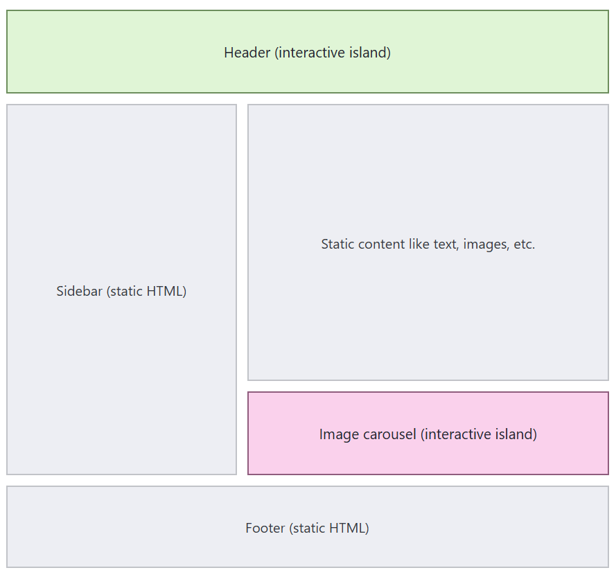

# Content
1. [Introduction](#1-introduction)
2. [Installation](#installation)


[Acknowledgment](#acknowledgment)

---

# 1. Introduction
- Astro is a modern web framework for building fast, content-focused websites.
- It is a framework that lets you build websites using React, Vue, Svelte, Solid, etc., while sending as little JavaScript to the browser as possible.
- It ship zero JavaScript to browser by default that makes it a great option for static sites

### Island Architecture
Islands architecture works by rendering the majority of your page to fast, static HTML with smaller “islands” of JavaScript added when interactivity or personalization is needed on the page (an image carousel, for example).

An Island in Astro is basically an interactive UI component that gets its own JavaScript, while the rest of the page can remain plain HTML.

An Island is framework agnostic that is Astro islands can use any UI frameworks such as:
- React
- Vue
- Svelte
- Preact
- Solid
> Different frameworks can even be used on the same Astro page.

Mental model:\
`Mostly static HTML + small interactive JavaScript islands`



**There are two type of island:**
1. **client island:** an interactive JavaScript UI component that is hydrated separately from the rest of the page
2. **server island:** a UI component that server-renders its dynamic content separately from the rest of the page.

Both islands run expensive or slower processes independently, on a per-component basis, for optimized page loads.


> Astro ships zero JavaScript by default and uses Island Architecture to add JavaScript only where interactivity is needed.

### Why is this useful?
Consider a normal React website.

You might have:
```
100 components
       ↓
Lots of JavaScript
       ↓
Browser downloads it
       ↓
Browser executes it
```
With Astro:
```
100 components
       ↓
95 static components → HTML
5 interactive components → JavaScript
```
So the browser has much less work to do.

That's where Astro's performance advantage comes from.

[Go To Top](#content)

---

# Installation

[official installation doc](https://docs.astro.build/en/install-and-setup/)

1. make sure you have Node `v22.12.0` or higher
    ```bash
    node --version
    ```

2. create a astro project
    ```bash
    npm create astro@latest
    ```

3. If all goes well, you will see a success message followed by some recommended next steps.
    - provide the name of the directory where you want the project to initiate
    - choose a template you want (for this project will be using `"Use minimal (empty) template"`)
    - install dependencies = yes
    - Initialize a new git repository? (optional) = yes / no

4. Now that your project has been created, you can `cd` into your new project directory to begin using Astro.
5. If you skipped the “Install dependencies?” step during the CLI wizard, then be sure to install your dependencies before continuing.
    ```bash
    npm install 
    ```
6. Start the astro server
    ```bash
    npm run dev
    ```

> just like `.jsx` extension in react in astro we have `.astro` extension in which we write the HTML looking code
 
> it is recommended to install the official astro extension inside your IDE 

[Go To Top](#content)

---

# Acknowledgment

- official doc - [https://docs.astro.build/en/getting-started/](https://docs.astro.build/en/getting-started/)
- [Net Ninja](https://www.youtube.com/redirect?event=channel_header&redir_token=QUZZTVljRnJSTjdjeFU2U2xoTFVyZE9vZlhWZHxBTl9pYzRlQm5ZRnc4azBCSlJCWlgxempvdHUzaW9GcFRUTXpEZlFSNVRxYjh2VHdObkFpSkc4TjMyTmp6OE5UQ1o5QXdCbm5xMFdScUFLZDNHZHotZzl1MWJhSDVRQUZYSGR5&q=https%3A%2F%2Fnetninja.dev) - Astro tutorial playlist