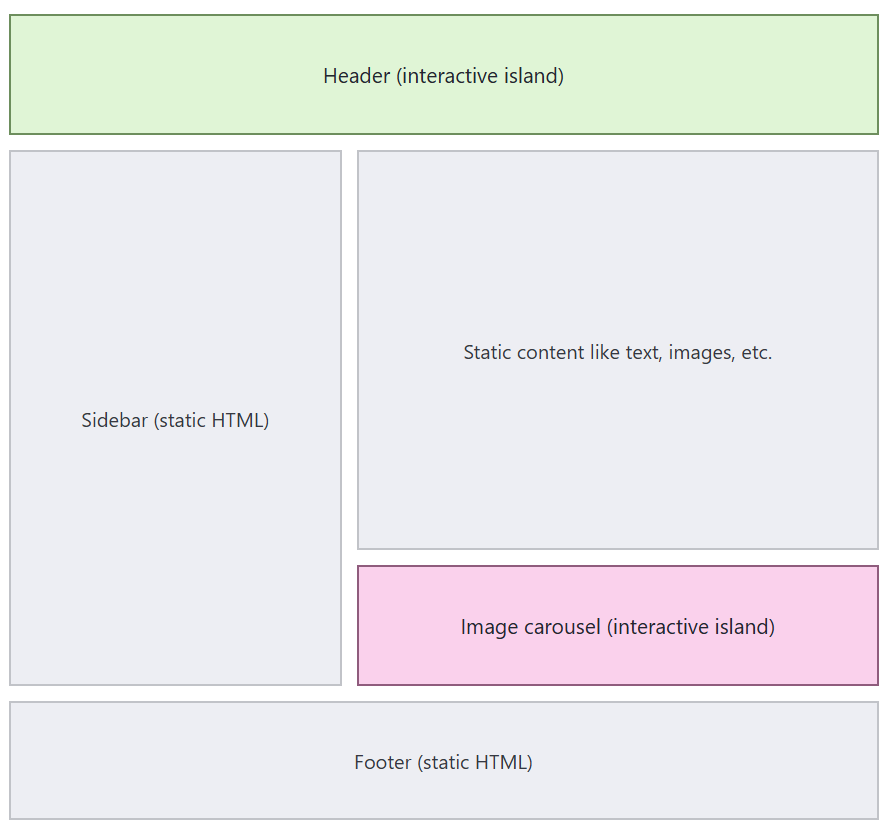

# Content

1. [Introduction](#introduction)
2. [Installation](#installation)
3. [Astro Syntax](#astro-syntax)
4. [Routing](#routing)
5. [Layout](#layout)
6. [Island](#islands)

[Acknowledgment](#acknowledgment)

---

# Introduction

- Astro is a modern web framework for building fast, content-focused websites.
- It is a framework that lets you build websites using React, Vue, Svelte, Solid, etc., while sending as little JavaScript to the browser as possible.
- It ship zero JavaScript to browser by default that makes it a great option for static sites

### Island Architecture

Islands architecture works by rendering the majority of your page to fast, static HTML with smaller “islands” of JavaScript added when interactivity or personalization is needed on the page (an image carousel, for example).

An Island in Astro is basically an interactive UI component that gets its own JavaScript, while the rest of the page can remain plain HTML.

An Island is framework agnostic that is Astro islands can use any UI frameworks such as:

- React
- Vue
- Svelte
- Preact
- Solid

> Different frameworks can even be used on the same Astro page.

Mental model:\
`Mostly static HTML + small interactive JavaScript islands`



**There are two type of island:**

1. **client island:** an interactive JavaScript UI component that is hydrated separately from the rest of the page
2. **server island:** a UI component that server-renders its dynamic content separately from the rest of the page.

Both islands run expensive or slower processes independently, on a per-component basis, for optimized page loads.

> Astro ships zero JavaScript by default and uses Island Architecture to add JavaScript only where interactivity is needed.

### Why is this useful?

Consider a normal React website.

You might have:

```
100 components
       ↓
Lots of JavaScript
       ↓
Browser downloads it
       ↓
Browser executes it
```

With Astro:

```
100 components
       ↓
95 static components → HTML
5 interactive components → JavaScript
```

So the browser has much less work to do.

That's where Astro's performance advantage comes from.

[Go To Top](#content)

---

# Installation

[official installation doc](https://docs.astro.build/en/install-and-setup/)

1. make sure you have Node `v22.12.0` or higher

    ```bash
    node --version
    ```

2. create a astro project

    ```bash
    npm create astro@latest
    ```

3. If all goes well, you will see a success message followed by some recommended next steps.
    - provide the name of the directory where you want the project to initiate
    - choose a template you want (for this project will be using `"Use minimal (empty) template"`)
    - install dependencies = yes
    - Initialize a new git repository? (optional) = yes / no

4. Now that your project has been created, you can `cd` into your new project directory to begin using Astro.
5. If you skipped the “Install dependencies?” step during the CLI wizard, then be sure to install your dependencies before continuing.
    ```bash
    npm install
    ```
6. Start the astro server
    ```bash
    npm run dev
    ```

> just like `.jsx` extension in react in astro we have `.astro` extension in which we write the HTML looking code

> it is recommended to install the official astro extension inside your IDE

### Astro telemetry

whe you run `npm run dev` you might see something like

```bash
> abc@0.0.1 dev
> astro dev

▶ Astro collects anonymous usage data.
  This information helps us improve Astro.
  Run "astro telemetry disable" to opt-out.
  https://astro.build/telemetry
```

That's not an error. Your Astro project has started normally.

This message is just Astro informing you about telemetry (anonymous usage statistics).

Astro telemetry is anonymous usage data that Astro collects from the Astro CLI when you use it.

Think of it like:

```
You run:
npm run dev

        ↓

Astro CLI
        ↓
sends some anonymous usage statistics
        ↓
Astro developers use them to improve Astro
```

**What is it used for?**

Typically, telemetry helps the Astro team understand things such as:

- Which Astro versions are being used
- Which CLI commands/features are commonly used
- General environment information
- Error/crash information that helps diagnose issues

It is not required for Astro to work.

### Disable Astro telemetry

```bash
npx astro telemetry disable
```

And re-enable it later with:

```bash
npx astro telemetry enable
```

> So that message you saw isn't an error, warning, or indication that something is wrong with your project. It's simply Astro notifying you about its telemetry.

[Go To Top](#content)

---

# Astro Syntax

The basic astro code look like this:

```astro
---
const name = "Yadnesh";
const age = 20;
---

<h1>Hello {name}</h1>
<p>You are {age} years old.</p>
```

The important part is the `---`:

```astro
---
/* JavaScript/TypeScript */
---

<!-- HTML -->
```

Everything between the `---` fences is the component's frontmatter.

### Conditional rendering and Looping

it same as that of react where we use:

- curly bracket `{}` with `?` or `&&` operator for conditional rendering
- curly bracket `{}` with `.map()` for looping

Example for condition rendering:

```astro
---
const response = await fetch("https://api.example.com/users");
const user = await response.json();
---

<div>
{
    user ? <h1>Hello {user.name}</h1> : <h1>no user found</h1>
}
</div>
```

Example for looping:

```astro
---
const user = ["abc", "efg", "hij", "klm"]
---

<div>
{
    user.map(user => <h1>{user}</h1>)
}
</div>
```

Unlike react astro doesn't need a key prop at the time or rending a list as everything convert into html at build time that is before reaching browser

unlike react where we can have only return one element at a time in astro we can return multiple element

```astro
---
const users = [
    { name: "Rahul Sharma", email: "rahul.sharma@example.com" },
    { name: "Priya Patel", email: "priya.patel@example.com" },
    { name: "Amit Kumar", email: "amit.kumar@example.com" },
    { name: "Sneha Joshi", email: "sneha.joshi@example.com" },
    { name: "Yash Mehta", email: "yash.mehta@example.com" }
];
---

<div>
    {users.map((user) =>
        <h1>{user.name}</h1>
        <p>{user.email}</p>
    )}
</div>
```

### Reusable component

just as react in astro you can create a reusable component that you can use at multiple places in your UI

Example:

- create a file where you'll write your component code
    ```astro
    <!-- ./src/component/userCard.astro -->
    ---
    interface Props {   // typescript interface that define the type of a props to be accepted
        user: {
            name: string;
            email: string;
        };
    }

    const { user } = Astro.props;   // to accept the props from the parent
    ---
    <div>
        <h1>{user.name}</h1>
        <p>{user.email}</p>
    </div>
    ```
- import that component in the parent with any name you want (make sure name start with capital)

    ```astro
    <!-- ./src/pages/index.astro -->
    ---
    import MyUserCard from "../components/userCard.astro" // instead of MyUserCard you can name it anything as long as first letter is capital
    ---
    <div>
        {users.map((user) => <MyUserCard user={user} />)}
    </div>
    ```

### What is frontmatter?

- In Astro, frontmatter is the JavaScript/TypeScript section at the top of an `.astro` file, enclosed by `---`.
- The term comes from static-site/content systems where metadata and processing instructions are placed before the main content.

Astro frontmatter does not run in the browser by default. It runs on the server/build side.

### Example

```astro
---
const response = await fetch("https://api.example.com/users");
const user = await response.json();

console.log("FRONTMATTER");
---

<h1>Hello {user.name}</h1>

<script>
  console.log("BROWSER");
</script>
```

Astro processes this roughly like:

```
             Astro
               │
               ▼
       ┌─────────────────┐
       │   Frontmatter   │
       │                 │
       │ fetch API       │
       │ calculate data  │
       │ console.log()   │
       └────────┬────────┘
                │
                ▼
          Generate HTML
                │
                ▼
          Send to browser
                │
                ▼
       <h1>Hello John</h1>
```

The browser receives something like:

```html
<h1>Hello John</h1>
```

It doesn't receive the frontmatter JavaScript itself.

So this:

```astro
---
console.log("FRONTMATTER")
---
```

doesn't become browser JavaScript.

The browser doesn't execute:

```astro
---
console.log("FRONTMATTER")
---
```

### Why is this useful?

1. **You can safely do server-side work**

    For example:

    ```astro
    ---
    const response = await fetch(
      "https://api.example.com/users"
    );

    const users = await response.json();
    ---
    ```

    Astro can fetch the data and generate:

    ```html
    <ul>
        <li>Yadnesh</li>
        <li>Rahul</li>
        <li>Atharva</li>
    </ul>
    ```

    The browser doesn't need the fetching code.

2. **Secrets don't have to be sent to the browser**

    For example:

    ```astro
    ---
    const API_KEY = import.meta.env.API_KEY;

    const response = await fetch(
        "https://api.example.com",
        {
            headers: {
                Authorization: `Bearer ${API_KEY}`
            }
        }
    );
    ---
    ```

    The API key is used during server-side processing and is not sent to browser.

    > You must still be careful not to put the secret into the generated HTML:

[Go To Top](#content)

---

# Routing

Astro uses file-based routing (same as Next.js)

Your folder and file structure inside src/pages/ directly determine your URLs.

### 1. Basic routing

Suppose your Astro project looks like:

```
src/
└── pages/
    ├── index.astro
    ├── about.astro
    ├── contact.astro
    └── services.astro
```

Astro automatically creates:

```
index.astro      → /
about.astro      → /about
contact.astro    → /contact
services.astro   → /services
```

There is no router configuration file you need to maintain.

### 2. Folders become URL segments

You can nest folders:

```
src/pages/
├── index.astro
├── about/
│   ├── index.astro
│   └── team.astro
└── products/
    ├── index.astro
    └── pricing.astro
```

Routes become:

```
/                    → index.astro
/about               → about/index.astro
/about/team          → about/team.astro
/products            → products/index.astro
/products/pricing    → products/pricing.astro
```

### 3. Dynamic routes

This is where Astro becomes more interesting.

Suppose you have products:

```
/products/laptop
/products/phone
/products/tablet
```

You don't want to manually create:

```
laptop.astro
phone.astro
tablet.astro
```

Instead:

```
src/pages/products/[product].astro
```

The `[product]` is a dynamic parameter.

Inside the page:

```js
---
const { product } = Astro.params;
---

<h1>Product: {product}</h1>
```

[Go To Top](#content)

---

# Layout

Astro layouts are basically a reusable component that defines the common HTML structure of multiple pages — navbar, footer, `<head>`, global styles, etc.

### 1. Basic layout

Suppose you create:

```
src/
├── layouts/
│   └── Layout.astro
│
└── pages/
    ├── index.astro
    └── about.astro
```

Your layout:

```html
<!-- src/layouts/Layout.astro -->

<html lang="en">
    <head>
        <meta charset="UTF-8" />
        <meta name="viewport" content="width=device-width" />
        <title>Layout</title>
    </head>

    <body>
        <nav>
            <a href="/">Home</a>
            <a href="/about">About</a>
        </nav>

        <main>
            <slot />
        </main>

        <footer>My Website</footer>
    </body>
</html>
```

The key concept is `<slot />`.

suppose your page:

```astro
<!-- src/layouts/index.astro -->
---
import Layout from "../layouts/Layout.astro";
---

<Layout title="Home">
  <h1>Welcome to my website</h1>
  <p>This is the home page.</p>
</Layout>
```

The `<slot />` gets replaced by the content inside `<Layout>`.

So Astro effectively produces:

```html
<body>
    <nav>...</nav>

    <main>
        <h1>Welcome to my website</h1>
        <p>This is the home page.</p>
    </main>

    <footer>My Website</footer>
</body>
```

Creating:

```
src/layouts/MainLayout.astro
```

does not automatically make every page use it.

You explicitly import it:

```astro
---
import MainLayout from "../layouts/MainLayout.astro";
---

<MainLayout>
  <h1>Hello</h1>
</MainLayout>
```

### 2. Passing data to layouts

You can pass props exactly like an Astro component.

Layout:

```astro
<!-- src/layouts/Layout.astro -->
---
const { title, description } = Astro.props;
---

<html>
  <head>
    <title>{title}</title>
    <meta name="description" content={description} />
  </head>

  <body>
    <slot />
  </body>
</html>
```

Page:

```astro
<!-- src/pages/about.astro -->
---
import Layout from "../layouts/Layout.astro";
---

<Layout
  title="About Us"
  description="Learn more about our company"
>
  <h1>About Us</h1>
</Layout>
```

Now the layout receives:

```js
{
  title: "About Us",
  description: "Learn more about our company"
}
```

### 3. Nested layouts

Imagine your application has:

```
src/
├── layouts/
│   ├── MainLayout.astro
│   └── DashboardLayout.astro
│
└── pages/
    ├── index.astro
    └── dashboard/
        ├── index.astro
        └── settings.astro
```

You could have:

```
MainLayout
│
├── Navbar
├── content
└── Footer
```

And then:

```
DashboardLayout
│
├── Sidebar
└── content
```

DashboardLayout can itself use MainLayout:

```astro
<!-- src/layouts/DashboardLayout.astro -->
---
import MainLayout from "./MainLayout.astro";
---

<MainLayout title="Dashboard">

  <div class="dashboard">
    <aside>
      Dashboard Sidebar
    </aside>

    <main>
      <slot />
    </main>
  </div>

</MainLayout>
```

Then:

```astro
<!-- src/pages/dashboard/index.astro -->
---
import DashboardLayout from "../../layouts/DashboardLayout.astro";
---

<DashboardLayout>
  <h1>Dashboard</h1>
</DashboardLayout>
```

### 3. Multiple slots

You can also have named slots.

For example:

```astro
---
const { title } = Astro.props;
---

<html>
  <head>
    <title>{title}</title>
  </head>

  <body>

    <header>
      <slot name="header" />
    </header>

    <main>
      <slot />
    </main>

    <footer>
      <slot name="footer" />
    </footer>

  </body>
</html>
```

Then:

```html
<Layout title="Home">
    <div slot="header">Custom Header</div>

    <h1>Main Content</h1>

    <div slot="footer">Custom Footer</div>
</Layout>
```

The slots get populated accordingly.

[Go To Top](#content)

---
#  Islands
An Island in Astro is basically an interactive UI component that gets its own JavaScript, while the rest of the page can remain plain HTML.

> To learn more check out the [Introduction Part](#introduction)

To add the island in your astro app just follow the following steps:

### 1. install library
to use another library as a island in your astro project you first need to install that library into your project

Example: to use react island you first need to install react into your astro project

Astro provides integration method to integrate such library 

example for react island astro integration:
```
npx astro add react
```

> visit the [official doc](https://docs.astro.build/en/guides/framework-components/) to know more

### 2. Create your react component
```tsx
// ./src/components/ReactComponent.tsx
import React, { useState } from 'react'

export default function ReactComponent() {
    const [count, setCount] = useState(0);

    const increment = () => {
        setCount(count + 1);
        console.log(count);
    }
  return (
    <div>
      this is a react component
      <button onClick={increment}>count is {count}</button>
    </div>
  )
}
```
### 3. import it into the astro page
```astro
---
import ReactComponent from "../components/ReactComponent";
---

<div>
    <!-- This component's JS will begin importing when the page loads -->
    <ReactComponent client:only/>
</div>
```
> since we are using react setState we need the components js to be loaded on client/browser
>
> Check [official doc](https://docs.astro.build/en/guides/framework-components/#hydrating-interactive-components) to know more


[Go To Top](#content)

---

# Acknowledgment

- official doc - [https://docs.astro.build/en/getting-started/](https://docs.astro.build/en/getting-started/)
- [Net Ninja](https://www.youtube.com/redirect?event=channel_header&redir_token=QUZZTVljRnJSTjdjeFU2U2xoTFVyZE9vZlhWZHxBTl9pYzRlQm5ZRnc4azBCSlJCWlgxempvdHUzaW9GcFRUTXpEZlFSNVRxYjh2VHdObkFpSkc4TjMyTmp6OE5UQ1o5QXdCbm5xMFdScUFLZDNHZHotZzl1MWJhSDVRQUZYSGR5&q=https%3A%2F%2Fnetninja.dev) - Astro tutorial playlist
